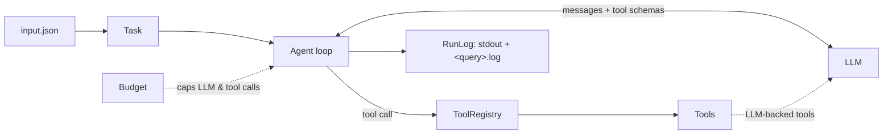

# LLM Tool-Calling Agent

An LLM agent written from scratch on the raw OpenAI tool-calling API. No LangChain, LangGraph or other agent framework. Give it a natural-language query and a set of files. The model decides which tools to call and in what order, and keeps going until the query is answered.

```text
"Look at the receipt in receipt.png, find all historical orders from that merchant in
 orders.db, compute what percentage the receipt is of their total, and look up the city
 of the top customer in customers.db. Write the result to receipt_analysis_result.json."
```

```text
Calling LLM for next tool to invoke
** Entering tool extract_from_image **       -> {"merchant": "Blue Moon Cafe", "total": 87.45, ...}
** Entering tool build_sql_query **          -> SELECT SUM(amount), ... FROM orders WHERE ...
** Entering tool execute_sql_query **        -> [{"total": 1240.3, "top_customer_id": "C0.."}]
** Entering tool build_sql_query **          -> SELECT city FROM customers WHERE ...
** Entering tool execute_sql_query **        -> [{"city": "Haifa"}]
** Entering tool calculator **               -> round(87.45 / 1240.3 * 100, 2) = 7.05
** Entering tool write_file **               -> receipt_analysis_result.json
final response is = The receipt from Blue Moon Cafe (87.45) is 7.05% of ...
```

## Tools

| Tool | What it does |
|---|---|
| `extract_from_image` | Vision model reads a receipt/invoice image into JSON |
| `build_sql_query` | Text-to-SQL: writes a SQLite query from a schema description |
| `execute_sql_query` | Runs SQL against a `.db` file, **read-only** |
| `calculator` | Safe arithmetic by walking the AST (never `eval`) |
| `web_search` | DuckDuckGo search for facts not in the provided files |
| `write_file` | Writes the output files the query asks for |

## How it works



- **`Agent`** ([agent.py](tool_agent/agent.py)) runs the loop. It sends the conversation and the tool schemas to the model, runs each tool call, and appends the result. It stops when the model answers without calling a tool. If a tool fails, gets malformed arguments or names a tool that doesn't exist, the error goes back to the model as `{"error": ...}` so it can recover instead of crashing the run.
- **`Tool` / `ToolRegistry`** ([tools/base.py](tool_agent/tools/base.py)) keep each tool's JSON schema next to the code that runs it. Adding a tool takes one module plus one line in [`build_toolbox`](tool_agent/tools/__init__.py).
- **`LLM`** ([llm.py](tool_agent/llm.py)) is one client shared by the agent loop and the LLM-backed tools. It charges every request to the run's **`Budget`**, which caps a run at 20 LLM calls and 20 tool calls.
- **`Task` / `Workspace`** ([task.py](tool_agent/task.py)) load the query and resources from `input.json`. All file paths are resolved relative to the folder that holds `input.json`, so you can run a task from any directory.

## Quickstart

```bash
python3 -m venv .venv && source .venv/bin/activate
pip install -e ".[dev]"
cp .env.example .env        # then set AZURE_OPENAI_API_KEY and AZURE_OPENAI_ENDPOINT

python -m tool_agent examples/receipt_analysis/input.json
```

Outputs (`receipt_analysis_result.json` and the `receipt_analysis.log` transcript) are written next to `input.json`.

## Writing a task

A task is a folder containing an `input.json` manifest, a query file, and any resource files:

```json
{
  "query_name": "receipt_analysis.txt",
  "resources": [
    { "file_name": "receipt.png", "description": "A receipt image ..." },
    { "file_name": "orders.db", "description": "SQLite table orders(order_id, merchant, amount, ...)" }
  ]
}
```

The model sees the resource descriptions, so include table schemas for databases.

## Tests

```bash
pytest
```

The suite runs offline. A scripted fake LLM drives the agent loop through tool chaining, error recovery and both call caps. The tools are tested against real temporary SQLite files.

## Project layout

```text
tool_agent/
  agent.py          the tool-calling loop
  cli.py            entry point: wires settings, client, tools and agent
  config.py         settings from environment variables
  task.py           Task manifest loading and Workspace path resolution
  llm.py            budget-charging chat-completions client
  budget.py         LLM / tool call caps
  run_log.py        transcript to stdout and <query>.log
  prompts.py        system prompt and user message
  tools/            one module per tool, plus Tool/ToolRegistry in base.py
examples/receipt_analysis/   sample task with validator
tests/
```

## Authors

Shachar Ben Zur and Ron Isakov. Originally built for a university assignment on LLM tool calling.
