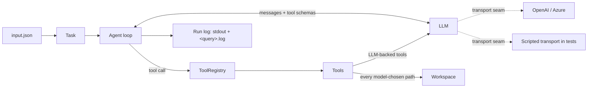

# LLM Tool-Calling Agent

An LLM agent written from scratch on the raw OpenAI tool-calling API. No LangChain, LangGraph or other agent framework. Give it a natural-language query and a set of files. The model decides which tools to call and in what order, and keeps going until the query is answered.

```text
"Look at the receipt in receipt.png, find all historical orders from that merchant in
 orders.db, compute what percentage the receipt is of their total, and look up the city
 of the top customer in customers.db. Write the result to receipt_analysis_result.json."
```

```text
Calling LLM for next tool to invoke
** Entering tool extract_from_image **       -> {"merchant": "Blue Moon Cafe", "total": 87.45, ...}
** Entering tool build_sql_query **          -> SELECT SUM(amount), ... FROM orders WHERE ...
** Entering tool execute_sql_query **        -> [{"total": 1240.3, "top_customer_id": "C0.."}]
** Entering tool build_sql_query **          -> SELECT city FROM customers WHERE ...
** Entering tool execute_sql_query **        -> [{"city": "Haifa"}]
** Entering tool calculator **               -> round(87.45 / 1240.3 * 100, 2) = 7.05
** Entering tool write_file **               -> receipt_analysis_result.json
final response is = The receipt from Blue Moon Cafe (87.45) is 7.05% of ...
```

## Tools

| Tool | What it does |
|---|---|
| `extract_from_image` | Vision model reads a receipt/invoice image into JSON |
| `build_sql_query` | Text-to-SQL: writes a SQLite query from a schema description |
| `execute_sql_query` | Runs SQL against a `.db` file, **read-only** |
| `calculator` | Safe arithmetic by walking the AST (never `eval`) |
| `web_search` | DuckDuckGo search for facts not in the provided files |
| `write_file` | Writes the output files the query asks for |

## How it works



- **`Agent`** ([agent.py](agent/agent.py)) runs the loop. It sends the conversation and the tool schemas to the model, runs each tool call, and appends the result. It stops when the model answers without calling a tool. If a tool fails, gets malformed arguments or names a tool that doesn't exist, the error goes back to the model as `{"error": ...}` so it can recover instead of crashing the run. If the provider rejects a request (content filter, context too long), the agent removes the newest tool results and retries once instead of resending the same content.
- **`LLM`** ([llm.py](agent/llm.py)) is the only way to reach the model. The agent loop and the LLM-backed tools (vision, text-to-SQL) all go through it, so it can enforce the **LLM-call cap** for every request. Behind it sits a **transport**: the OpenAI client in production, a scripted one in tests.
- **`Tool` / `ToolRegistry`** ([tools/base.py](tools/base.py)) keep each tool's JSON schema next to the code that runs it. Adding a tool takes one module plus one line in [`build_toolbox`](agent/toolbox.py), and the call caps apply to it automatically.
- **`Workspace`** ([task.py](agent/task.py)) checks every path the model chooses:
  - paths that leave the task folder are refused, including `..`, absolute paths and symlinks;
  - the task's own inputs and its log can't be overwritten;
  - SQL runs read-only, with an allow-list authorizer, so `ATTACH` and `VACUUM INTO` can't touch the disk.

Domain terms are defined in [GLOSSARY.md](GLOSSARY.md).

## Quickstart

Requires Python 3.11+.

```bash
python3 -m venv .venv && source .venv/bin/activate
pip install -e ".[dev]"
cp .env.example .env        # then set AZURE_OPENAI_API_KEY and AZURE_OPENAI_ENDPOINT

python -m agent examples/receipt_analysis/input.json
python -m agent --help  # --max-llm-calls / --max-tool-calls (default 20 each)
```

Outputs (`receipt_analysis_result.json` and the `receipt_analysis.log` run log) are written next to `input.json`.

From Python, `run_task` runs a task with any transport:

```python
from openai import OpenAI
from agent import Limits, OpenAITransport, run_task

transport = OpenAITransport(OpenAI(api_key=..., base_url=...), "gpt-4.1-mini")
answer = run_task("examples/receipt_analysis/input.json", transport, Limits(max_llm_calls=10))
```

## Writing a task

A task is a folder containing an `input.json` manifest, a query file, and any resource files:

```json
{
  "query_name": "receipt_analysis.txt",
  "resources": [
    { "file_name": "receipt.png", "description": "A receipt image ..." },
    { "file_name": "orders.db", "description": "SQLite table orders(order_id, merchant, amount, ...)" }
  ]
}
```

The model sees the resource descriptions, so include table schemas for databases.

## Tests

```bash
pytest
```

The suite runs offline. A scripted transport stands in for the provider, so everything above it runs for real:
- whole runs through `run_task` on temporary task folders;
- the LLM-call cap, including requests made inside tools;
- recovery from tool errors and provider rejections;
- path containment, with SQLite tested against real database files.

## Project layout

```text
agent/
  agent.py          the tool-calling loop, tool-call cap, rejection recovery
  cli.py            run_task (assembles a run) and the command line
  config.py         provider settings (env) and call caps
  task.py           Task manifest loading; Workspace path containment
  llm.py            LLM (LLM-call cap) and the transport seam
  run_log.py        run log to stdout and <query>.log
  prompts.py        system prompt, user message, recovery note
  toolbox.py        build_toolbox: binds the LLM and Workspace to the tools
tools/              the tools themselves: one module per tool, plus Tool/ToolRegistry in base.py
examples/receipt_analysis/   sample task with validator
tests/
```

## Authors

Shachar Ben Zur and Ron Isakov. Originally built for a university assignment on LLM tool calling.
